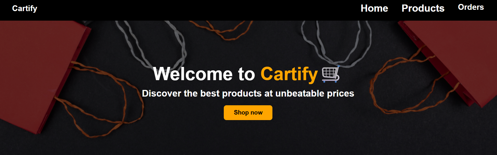
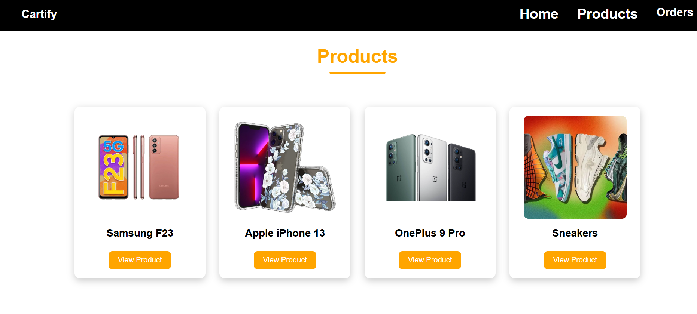
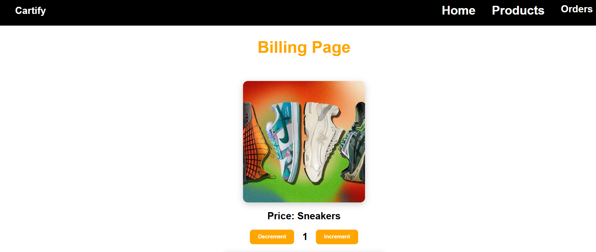

# Cartify E-Commerce Website 🛒

Cartify is a responsive e-commerce web application built using React.js where users can browse products, view product details, and place orders through a billing page.

## Features
- View product categories on homepage
- Browse all products
- View product details
- Increase/decrease product quantity
- Billing form for order placement
- Toast notifications after order success
- Responsive UI design

## Technologies Used
- React.js
- JavaScript
- CSS
- React Router DOM
- Axios
- JSON Server
- React Toastify

## Project Pages
- Home Page
- Products Page
- Product Detail Page
- Billing Page

# Cartify E-Commerce Website 🛒

## Home Page

## Products Page

## Product Detail Page

## Billing Page

